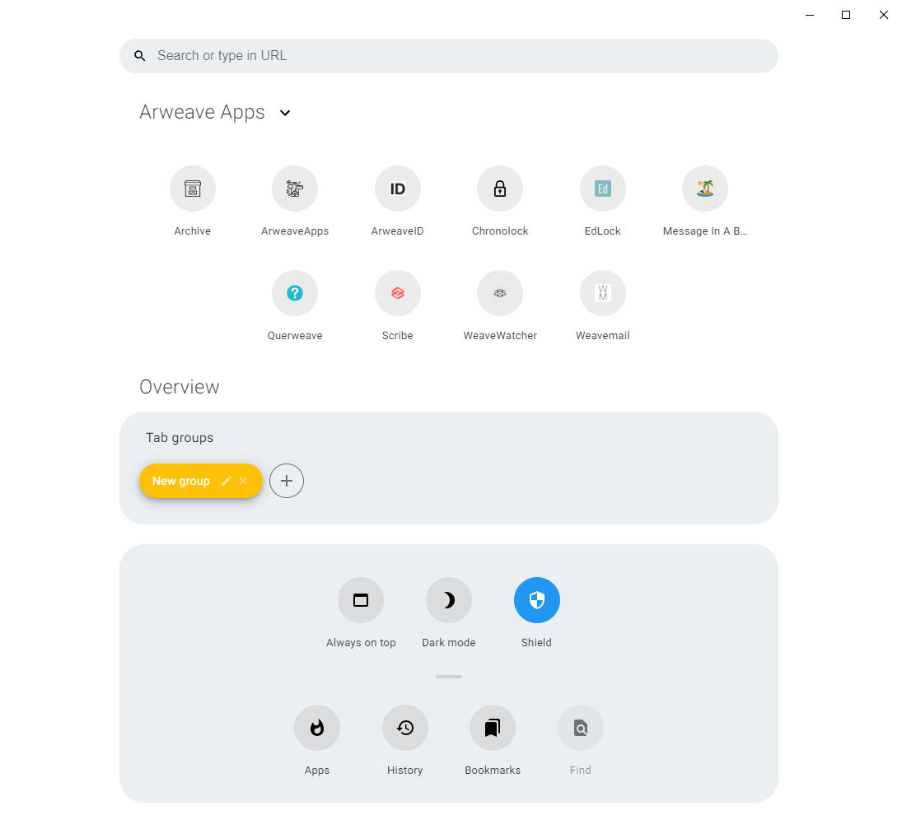

<p align="center">
  <a href="https://arweave.org"></a>
</p>

<div align="center">
  <h1>Arweave Browser</h1>

Arweave Browser is an extensible and privacy-focused web browser with a totally different user experience, built on top of `Electron`, `TypeScript`, `React` and `styled-components`. It aims to be fast, private, beautiful, extensible and functional.
The main idea of the browser is to easily navigate the permaweb, faster, more secure and with extra features.

</div>

# Features

- **ArweaveApps** - Arweave Apps are accessible directly from the intro screen.
- **Arweave Shield** - Browse the web without any ads and don't let websites to track you. Thanks to the Arweave Shield, websites can load even 2 times faster!
- **Beautiful and minimalistic UI** - The address bar is hidden in Overlay to take less space, but it doesn't impact on usability in any way. It's even better!
- **Tab groups** - Easily group tabs to groups and access them really fast.
- **Partial support for Chrome extensions** - Install some extensions from Chrome Web Store
- **Overlay** - It contains everything you will need. Search box, bookmarks, menu, your custom components and much more!
- **Packages** - Extend the Arweave Browser for your needs, by installing or developing your own packages. They can theme the browser and even add custom components to the Overlay!

# Screenshots



# Contributing

If you have found any bugs or just want to see some new features in Arweave Browser, feel free to open an issue. I'm open to any suggestions and bug reports would be really helpful for me and appreciated very much. Arweave Browser is in heavy development and some bugs may occur. Also, please don't hesitate to open a pull request. This is really important to me and for the further development of this project.

## Running

Before running Arweave Browser, please ensure you have [`Node.js`](https://nodejs.org/en/) installed on your machine.

Firstly, run this command to install all needed dependencies. If you have encountered any problems, please report it. I will try to help as much as I can.

```bash
$ npm install
```

The given command below will run Arweave Browser in the development mode.

```bash
$ npm run dev
```

## Other commands

You can also run other commands, for other tasks like building the app or linting the code, by using the commands described below.

### Usage:

```bash
$ npm run <command>
```

#### List of available commands:

| Command          | Description                                 |
| ---------------- | ------------------------------------------- |
| `build`          | Bundles Arweave Browser's source in production mode. |
| `compile-win32`  | Compiles Arweave Browser binaries for Windows.       |
| `compile-darwin` | Compiles Arweave Browser binaries for macOS.         |
| `compile-linux`  | Compiles Arweave Browser binaries for Linux.         |
| `lint`           | Lints code.                                 |
| `lint-fix`       | Fixes eslint errors if any                  |
| `start`          | Starts Arweave Browser.                              |
| `dev`            | Starts Arweave Browser in the development mode       |

